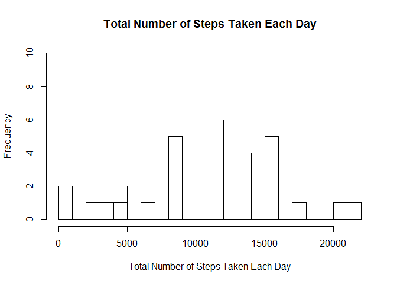
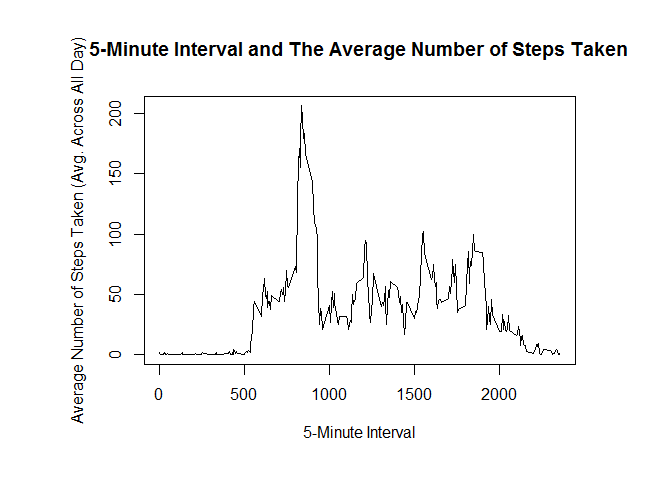
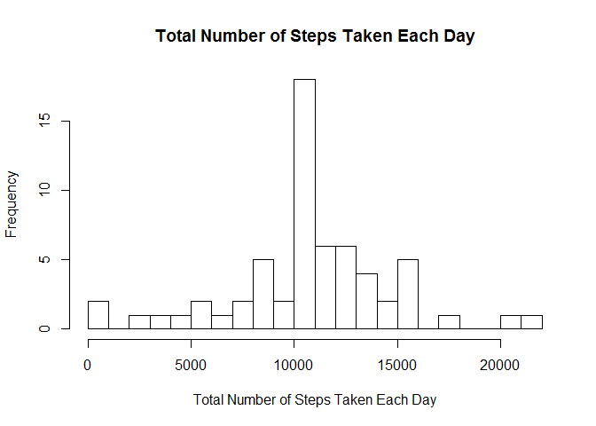
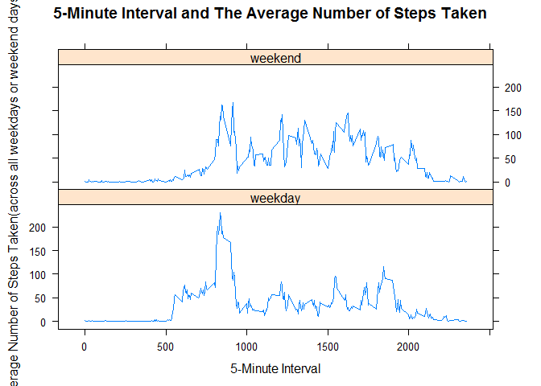

## Loading and preprocessing the data
1. Load the data (i.e. read.csv())

```r
#If activity.csv doesn't exist then unzip activity.zip 
if(!file.exists("activity.csv")){unzip("activity.zip")}
#Loading data
data<-read.csv("activity.csv")
```
2. Process/transform the data (if necessary) into a format suitable for your analysis

```r
#Converting date column to Date
data$date <- as.Date(data$date, format="%Y-%m-%d")
```
## What is mean total number of steps taken per day?
1. Make a histogram of the total number of steps taken each day

```r
#Summing the steps by date
totalSteps <- aggregate(steps ~ date, data, sum)

#Plotting histogram
hist(
  totalSteps$steps, 
  main = "Total Number of Steps Taken Each Day", 
  xlab= "Total Number of Steps Taken Each Day", 
  breaks = 20
)
```

<!-- -->

2. Calculate and report the mean and median total number of steps taken per day

```r
#Calculating mean
mean(totalSteps$steps)
```

```
## [1] 10766.19
```

```r
#Calculating median
median(totalSteps$steps)
```

```
## [1] 10765
```


## What is the average daily activity pattern?
1. Make a time series plot (i.e. type="l") of the 5-minute interval (x-axis) and the average number of steps taken, averaged across all days (y-axis) 

```r
#Calculating the average numberof steps taken 
intervalAvgSteps <- aggregate(steps ~ interval, data, mean, na.rm=TRUE)

#Plotting 
par(mai = c(1.2, 1.5, 1,1))
plot(x= intervalAvgSteps$interval,
     y= intervalAvgSteps$steps,
     type="l",
     main= "5-Minute Interval and The Average Number of Steps Taken",
     xlab = "5-Minute Interval",
     ylab = "Average Number of Steps Taken (Avg. Across All Day)")
```

<!-- -->

2. Which 5-minute interval, on average across all the daus in the dataset, contains the maximum number of steps?

```r
#Finding the maximum the interval that contains the maximum number of steps
max_interval <- intervalAvgSteps[which.max(intervalAvgSteps$steps),]
print(max_interval)
```

```
##     interval    steps
## 104      835 206.1698
```
#### Interval 835 

## Imputing missing values
1. Calculate and report the total numer of missing values in the dataset(i.e. the total number of rows with NA S)

```r
#Summing the total number of NA rows
totalMissingVal <- sum(is.na(data$steps))
print(totalMissingVal)
```

```
## [1] 2304
```

2. Devise a strategy for filling in all of the missing values in the dataset. The strategy does not need to be sophisticated. For example, you could use the mean/median for that day, or the mean for that 5-minute interval etc.

Filling all of the missing values with the mean for that 5-minute interval

3. Create a new dataset that is equal to the original dataset but with the missing data filled in

```r
#Renaming the steps columns to meanSteps
names(intervalAvgSteps)[2] <- "meanSteps"
#Merging data dataframe with interbalAvgSteps data frame
newData <- merge(data, intervalAvgSteps, by="interval", all.y = F)
#Filling all of the missing values with the mean for that 5-minute interval
newData$steps[is.na(newData$steps)] <- as.integer(round(newData$meanSteps[is.na(newData$steps)]))

#Checking for total number of NA rows
print(sum(is.na(newData$steps)))
```

```
## [1] 0
```

4.Make a histogram of the total number of steps taken each day and calculate the report the mean and median total number of steps taken per day. Do these values differ from the estimates from the first part of the assignment? What is the impact of imputing missing data on the estimates of the total daily number of steps?

The mean and median total number of steps taken per day do differ slightly.

**Before:**
Mean = 10766.19
Median = 10765

**After:**
Mean = 10765.64
Median = 10762

After imputing missing data with the average for that 5-minute interval both mean and median decreased slightly


```r
#Summing the steps by date
newTotalSteps <- aggregate(steps ~ date, newData, sum)

#Plotting histogram
hist(
  newTotalSteps$steps, 
  main = "Total Number of Steps Taken Each Day", 
  xlab= "Total Number of Steps Taken Each Day", 
  breaks = 20
)
```

<!-- -->

```r
#Calculating mean
mean(newTotalSteps$steps)
```

```
## [1] 10765.64
```

```r
#Calculating median
median(newTotalSteps$steps)
```

```
## [1] 10762
```
## Are there differences in activity patterns between weekdays and weekends?
1.Create a new factor variable in the dataset with two levels -- "weekday" and "weekend" indicating whether a given date is a weekday or weekend day.

```r
weekend <- weekdays(newData$date) %in% c("Saturday", "Sunday")
newData$dayType <- "weekday"

newData$dayType[weekend == TRUE] <- "weekend"
newData$dayType <- as.factor(newData$dayType)
```

2. Make a panel plot containing a time series plot (i.e. type = "l") of the 5-minute interval (x-axis) and the average number of steps taken, averaged across all weekday days or weekend days (y-axis). The plot should look something like the following, which was created using simulated data:

```r
dayTypeInterval <- aggregate(steps ~ interval + dayType, newData, mean)
library(lattice)

#Plotting 
xyplot(
  steps ~ interval | dayType,
  dayTypeInterval,
  type="l",
  layout= c(1,2),
  main = "5-Minute Interval and The Average Number of Steps Taken",
  xlab="5-Minute Interval",
  ylab="Average Number of Steps Taken(across all weekdays or weekend days)"
)
```

<!-- -->
